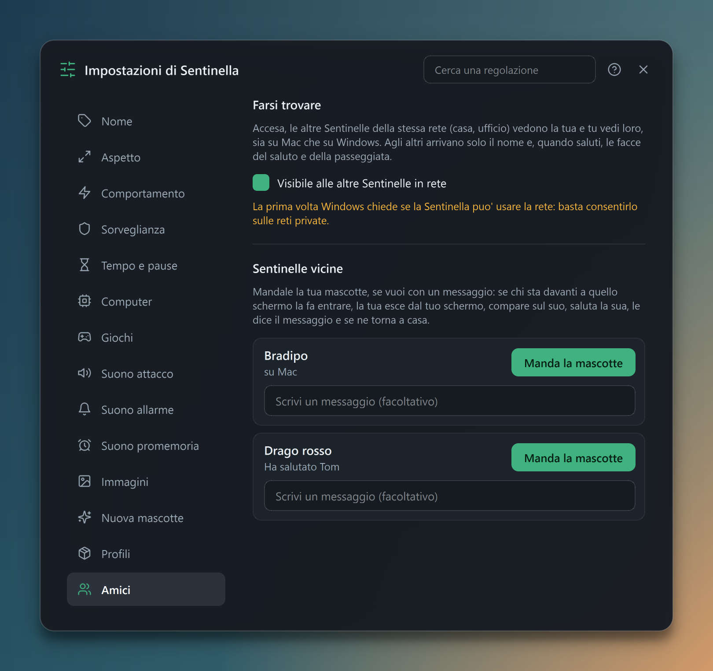
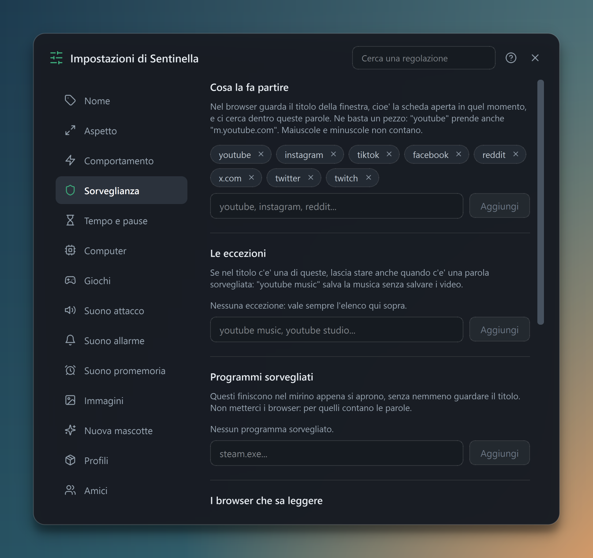
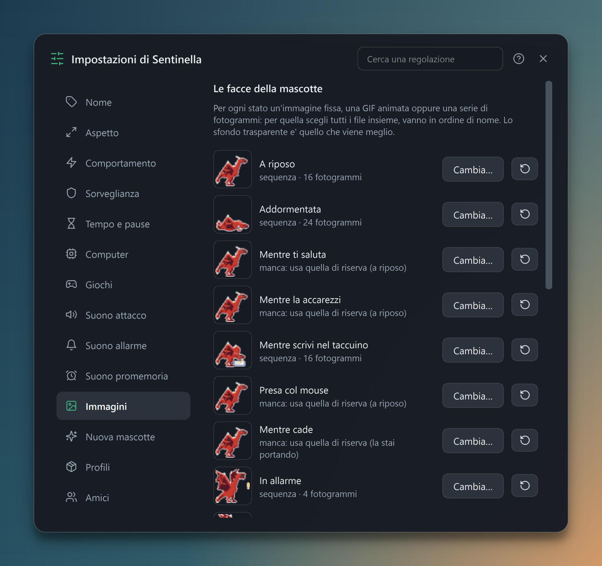
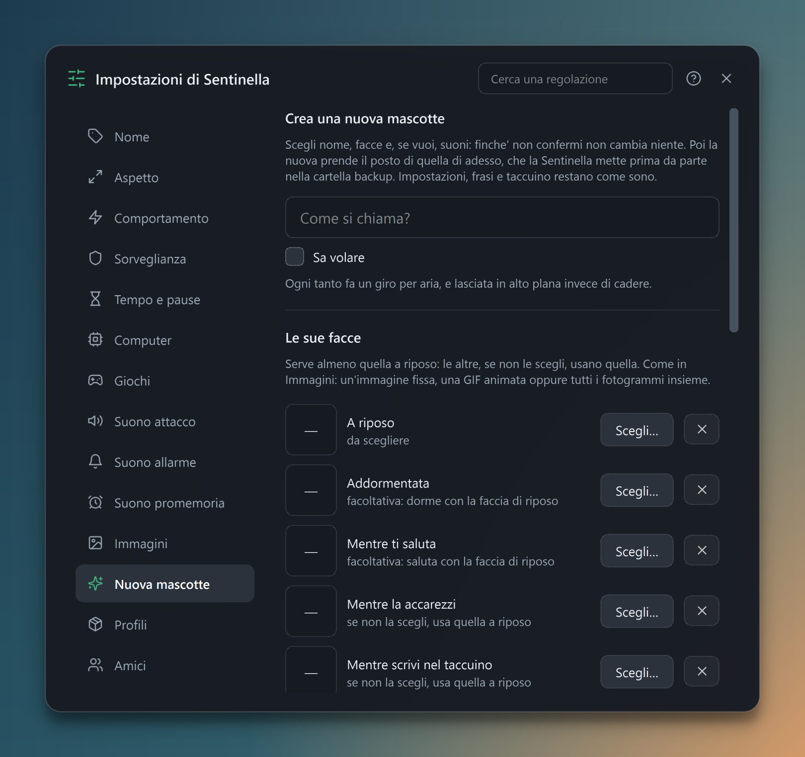
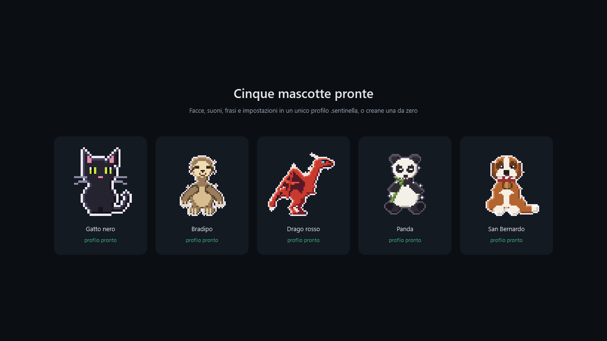
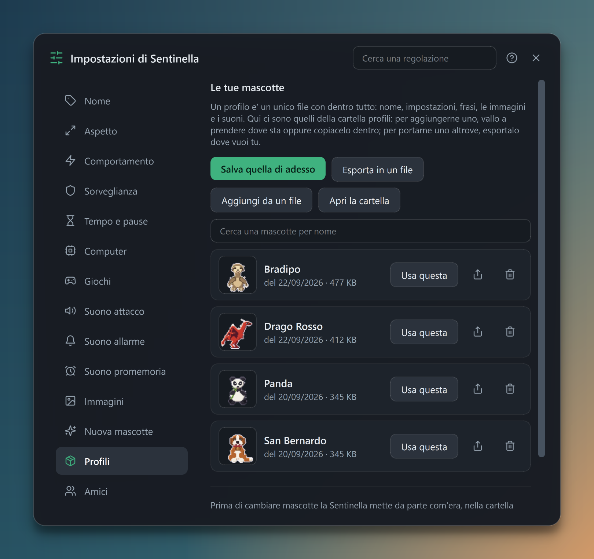

**Sentinella** is a Windows and macOS desktop app that puts a mascot on top of every window. It keeps you company: it strolls along the taskbar, plays ball, falls asleep and lets you pet it with the mouse. Meanwhile it keeps an eye on the screen: if YouTube, Instagram, TikTok or another doomscrolling site opens, it sounds the alarm, shakes for a few seconds and then, if the window is still there, runs to the **X** and closes **only that tab**.

It doesn't block anything on the network and doesn't read what you type: it only looks at the titles of open windows.

## What it does

- **Anti-doomscrolling**: recognises sites from the tab title (with blocked words and exceptions, e.g. `youtube` yes but `youtube music` no) and programs from the process name, then chases the window even if you move it
- **A life of its own**: resting, walks across multiple monitors, flights, falls with gravity and bounces, naps, a greeting when you come back to the PC, cuddles when you hover the mouse and a dedicated face for when it settles down to write too
- **Games**: throwing the ball (the ones that can fly chase it through the air), hide and seek, the trampoline (keep it in the air for two minutes while collecting dots, with a high score) and a pencil to draw a fence for it on the screen
- **Allowed time**: a few minutes of social media per day before it steps in, timed breaks and "do not disturb" in full screen
- **Dashboard** with the week's statistics: time on social media day by day, chases, closed tabs, most visited sites, plus ball throws, walks, metres covered and breaks
- **Notebook**: a **Markdown** note editor, with search, syntax that colours itself as you type, and a preview
- **Friends on the network**: Sentinelle on the same local network find each other and pay each other a visit
- **How the computer is doing**: CPU, RAM and temperature, with limits past which the mascot comes over to warn you
- **Motivational quotes** now and then, in the voice of whichever mascot you imported
- **Events and reminders**, with a speech bubble and a dedicated sound

## The mascot goes to visit its friends

With visibility on, the Sentinelle on the same local network find each other by themselves. Pick a mascot from the list, write a message, and at the other end a card appears: *"Pippo wants to drop by and say hello to Ugo. Will you let it in?"*. If they say yes, your mascot **walks off the edge of your screen** and only once it is fully out does it appear on your friend's: it arrives on foot at its own walking speed, stops next to the resident mascot, the two greet each other, it delivers the message and then leaves. It can also carry a note from the notebook, which lands among the other person's notes with the sender's name on it.

Underneath there's a UDP beacon broadcast every three seconds so they can be found, and a TCP connection with one JSON per line for the greeting; the greeting and walking faces travel as base64 PNGs. Since nobody authenticates, the protocol is written assuming anyone at all could be on the other end: images are only sent after the recipient says yes, lines have a ceiling, frames are counted and checked one by one (PNG only, signature verified before handing them to Qt), the name and message are stripped of control characters and bidi tricks, and a "doorkeeper" accepts one invitation per sender per minute. With visibility off, no socket stays open.

## Fully customisable

Everything is set from a single settings window, with a search that takes you straight to the right option and highlights it.

Every mascot state has its own "face": a still image, a GIF or a frame sequence, with an animated preview. The three sounds (alarm, attack, reminder) can be changed too, and can be extracted straight from a video's audio.

With **New mascot** you can create one from scratch: name, whether it can fly, faces and sounds. Before replacing the current one the app makes an automatic backup.

## Ready-made profiles

A whole mascot (settings, phrases, images and sounds) fits in a single `.sentinella` file to export, share with someone or import again. Besides the default **black cat** there are four more: a very slow **sloth**, a **red dragon**, a **panda** that rolls instead of walking and a **St Bernard**, each with its own sprites, sounds and phrases.

A profile can also be exported outside the folder — to the Desktop, a USB stick, a shared folder — and one picked up elsewhere can be added, going through the same checks before it is copied in.

The import treats the file as untrusted content: an allowlist of permitted paths, no `..` traversal or executables, explicit confirmation and a backup before overwriting.

## Italian and English

The app speaks two languages: by default it follows the system one, and it switches on the spot without restarting. The strings, though, stay written **in Italian in the code**, inside `tr()`: the Italian is the key and a catalogue says how it goes in English, so the code reads as it did before and a string without a translation yet comes out in Italian instead of breaking something. A test re-reads the source without running it and fails if a `tr()` has no entry in the catalogue, or if the catalogue still holds translations nobody uses any more.

## Windows and macOS, same code

Born on Windows, Sentinella now runs on **macOS 13+** too. Everything that isn't Qt (windows, mouse, keys, permissions, sounds, auto-start) sits behind a single contract, with one backend per operating system; the rest of the app is identical on both platforms.

On a Mac a few details change: the icon lives in the menu bar, the tab is closed with `Cmd+W`, the mascot stays above full-screen apps on every Space, and `.sentinella` profiles move from Windows to Mac and back. macOS does require two permissions granted by hand (**Screen Recording** to read window titles, **Accessibility** to close the tab), so the first-run walkthrough has a dedicated step with a button for each one and a check mark that appears as soon as it's granted. The only limited game is hide and seek: macOS doesn't let a window go behind another app's windows, so the mascot only hides past the screen edge.

> The macOS port is recent and hasn't been tried on a real Mac yet: for now it's verified by CI.

## How it's built

- **PySide6 (Qt)** for the transparent borderless windows, the animations and the whole interface, drawn with a consistent dark theme and vector icons
- A **`piattaforma/`** package with the shared contract and one backend per OS, so the logic can be imported and tested anywhere
- **Win32 API via `ctypes`** on Windows to enumerate windows, read titles and processes, find the close button and simulate clicks and `Ctrl+W`, handling DPI and multiple monitors
- **Quartz, AppKit, Accessibility, Carbon and AVFoundation via PyObjC** on macOS, with no private APIs that would break at every system update — the one exception is the temperature sensors, undocumented but read the same way by monitoring tools for years now
- **QtNetwork** for the greetings between Sentinelle: same code on both platforms, outside `piattaforma/`
- **psutil** for CPU and RAM, read on a separate thread because on Windows the temperature goes through PowerShell and costs a good second
- **Pixel art** sprites generated in code with `QPainter`, one script per mascot
- An interface that follows Windows scaling (100%–200%) with an extra preference for text and mascots
- Packaged with PyInstaller as **`Sentinella.exe`** on Windows and **`Sentinella.app` / `.dmg`** on Mac, or installed with a per-OS script that sets up Python, the virtual environment and auto-start
- **GitHub Actions** runs the tests on Windows and macOS on every push, builds the `.dmg` and, for each version, publishes the `.exe` and `.dmg` in a release

> The video at the top is an animation: the desktop, the taskbar and the browser window are drawn, while the mascot and the app's own windows are the real thing. The screenshots are captured from the application (in Italian).
